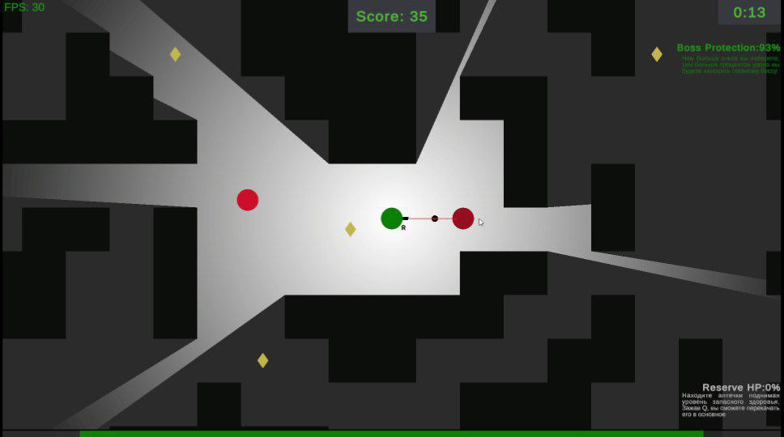

# Caves (v 1.0a)
[:ru: На русском языке](README_RU.md)
## About the Project
The **Caves** application is a game I created using the Unity engine in 2024. 
It is a top-down Roguelike with fully procedural generation of maps, enemies, and bosses, providing the player with a unique experience every time they play.
> ⚠️ **Note:** *Unfortunately, the source code was lost, but I still have the final build of the game available to play.*
## How to Run (ONLY WINDOWS)
To play the game yourself:
1. Go to the **Releases** tab of the project on GitHub.
2. Download the latest `Caves.V.1.0a.zip` file.
3. Extract the archive contents to a location of your choice.
4. Launch the game by double-clicking the `Caves(1.0a)` executable file.
## Core Gameplay
### Fully Procedural Map Generation
Caves, enemy placements, items, and the boss lair are generated randomly at the start of each run.     

### Diverse Enemies
You will encounter three types of enemies, each with its own unique mechanics.

### Final Boss
The final boss is stationary but has a large health pool and 6 unique attacks.

### Healing System
Find health kits scattered throughout the caves. Each collected kit refills your "reserve HP." If needed, transfer your reserve health to your main health bar by holding `Q`.

## Controls

`WASD` - Character movement.  
`LMB` - Shoot.  
`Space` - Dash.  
`Q` - Heal.  
`R` - Restart with cave regeneration.  

## Pro Tips 
1. You are invulnerable while dashing. Use this to dodge projectiles and enemies.
   
2. The final boss takes less damage if your score is low. Points are earned by killing enemies and collecting coins. The boss takes maximum damage when you have 500 points or more. You can see the boss's current armor status in the top right corner.
3. An indicator of approaching the final boss is a red health bar appearing above yours.
4. The blue tiles around the final boss arena protect you from all outside dangers during the fight.
5. Do not leave the boss arena, or the boss will begin to regenerate health rapidly.
6. During certain attacks, the boss becomes covered by a blue shield. In this state, it is completely invulnerable until you kill all summoned enemies on the battlefield.
## Extra Content
If you want to fight the final boss without the search and grind, use the test version of the game where you start right next to the arena. The test version is launched the same way as the main one. The test version zip file is named `Caves.BossTest.0.12.zip`.
> Note: use the cheat code `K` to disable the boss's armor without earning points.
## Cheat Codes
Use at your own discretion. Press the required key during gameplay:

`H` - Invincibility and regeneration (press again to disable).  
`J` - Dash with no cooldown (press again to disable).   
`K` - Gain 500 points.

## Tech Stack
* **Engine:** Unity 2024
* **Language:** C#